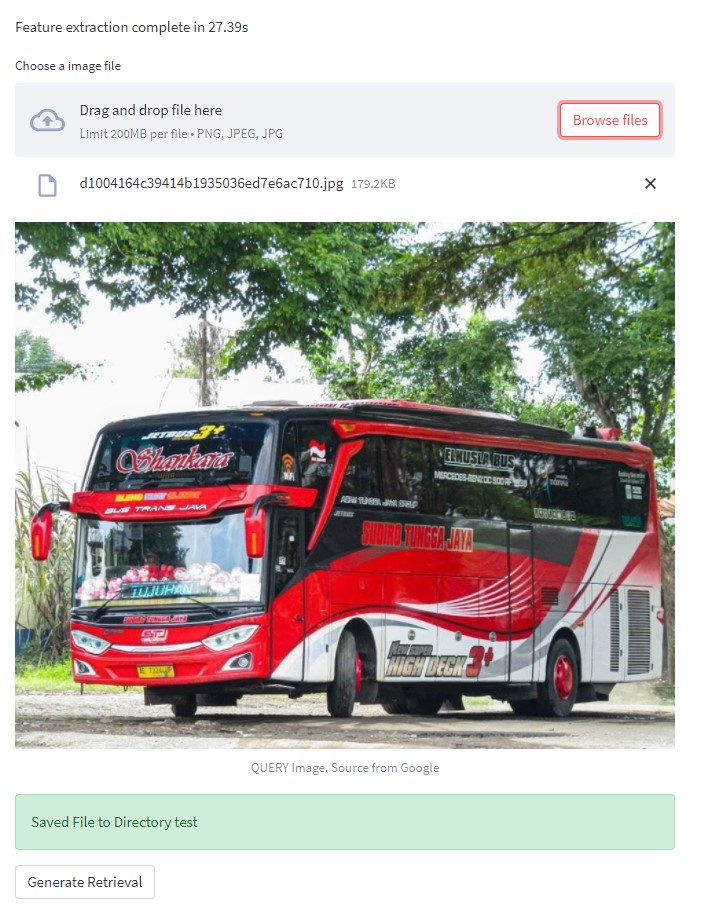
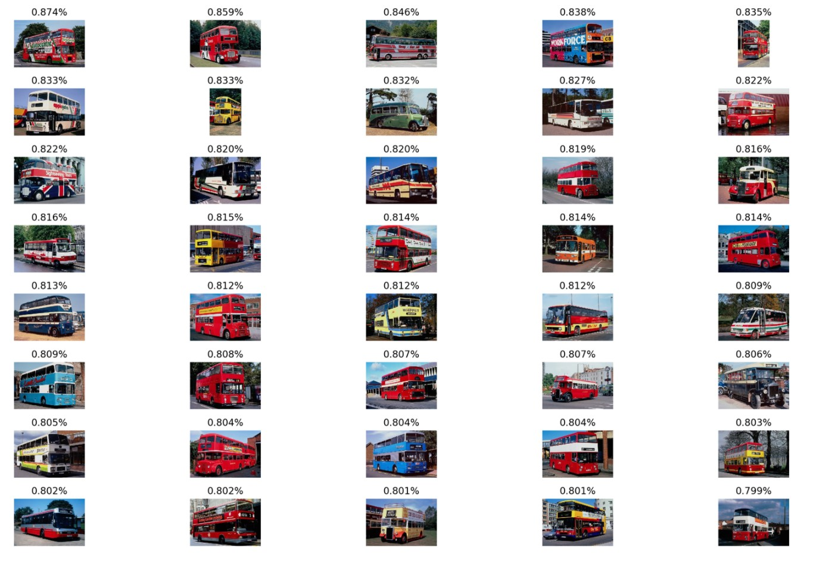
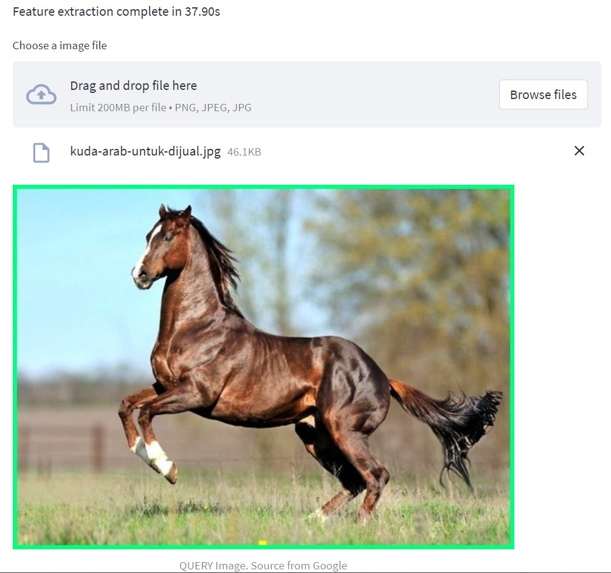
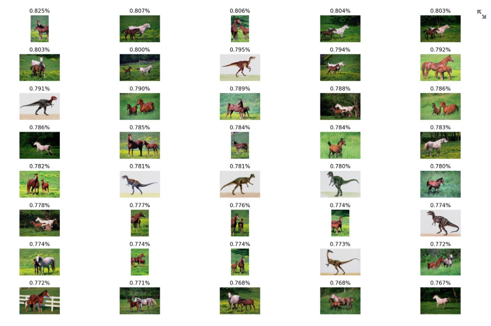

# Project_Temu_Kembali_Citra
Ini Merupakan Project Tugas Besar Kuliah Temu Kembali Citra

#  Dokumentasi Tugas Kelompok Pembelajaran Mesin

|Anggota|NIM  |
|--|--|
| M.Randy Anugerah| 201810370311051  |
| Alfin Yusriansyah| 201810370311057 |

## Link Dataset
Dataset : [CNN Corel Images Dataset](https://www.kaggle.com/elkamel/cnn-corel-images/data)

## Link Referensi
Jurnal Utama: [Improving CBIR accuracy using convolutional neural network for feature extraction](https://ieeexplore.ieee.org/abstract/document/8281730)

## Dokumentasi Tugas Kelompok Temu Kembali Citra
Pada project ini menggunakan dataset citra yang sudah tersedia di situs web Kaggle bernama “CNN Corel Images Dataset” yang memiliki data citra sebanyak 1000 dan 10 kelas.
Terdiri dari : Beaches, Bus, Dinosaurs, Elephants, Flower, Foods, Horses, Monuments, Mountain and Snow, People.
Tools yang digunakan untuk compile/running program adalah Google Colab dan Visual basic Code.

## Cara Menjalankan App program di lokal
- Clone github ini : **https://github.com/MRandyAnugerah/Project-Temu-Kembali-Citra.git**
- Buka project **temu-Kembali-Citra** pada text editor lokal anda dan instal *dependency* dan *library* yang dibutuhkan terutama **streamlit** untuk menjalakan app ini,
- jalankan **app.py** pada terminal dengan mengetik **streamlit run app.py**

## Input pertama dari aplikasi

## Hasil input pertama dari aplikasi

##---------------------------------------

## Input kedua dari aplikasi

## Hasil input kedua dari aplikasi

